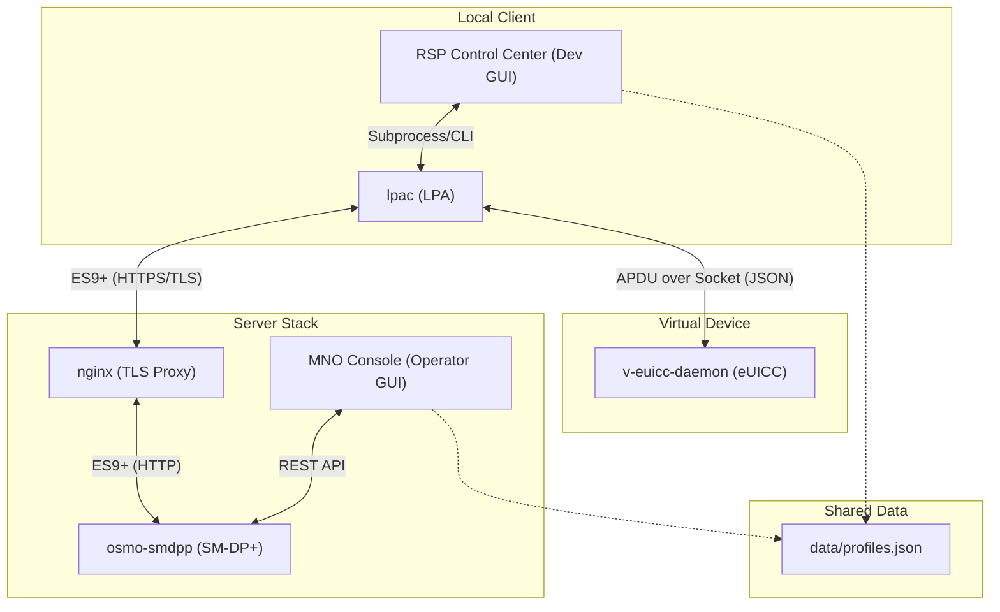

# Architecture Overview

**[← Previous: Setup](01-SETUP.md)** | **[Index](README.md)** | **[Next: RSP Flow →](03-RSP-FLOW.md)**

---

## Table of Contents
1. [System Diagram](#system-diagram)
2. [Core Components](#core-components)
3. [Data Persistence](#data-persistence)
4. [Communication Protocols](#communication-protocols)
5. [Deployment Topology](#deployment-topology)

---

This document describes the high-level architecture of the Virtual RSP system and the relationships between its core components.

## System Diagram

The system consists of an LPA client, a virtual eUICC daemon, and an SM-DP+ server stack.



## Core Components

### 1. LPA Client (`lpac`)
The Local Profile Assistant (LPA) is the client-side software responsible for:
- Orchestrating the download flow.
- Communicating with the SM-DP+ via ES9+ (HTTPS).
- Communicating with the eUICC via ES10x (APDU).
- **Modification**: We added a custom `socket` driver to `lpac` to allow it to send APDU commands over a TCP socket instead of physical smart card readers.

### 2. Virtual eUICC (`v-euicc-daemon`)
A custom C implementation that simulates an eSIM chip.
- Acts as a TCP server listening for APDU commands.
- Implements real ECDSA cryptography for mutual authentication.
- Manages internal state (EID, certificates, session keys).
- Persists installed profiles to the shared JSON store.

### 3. SM-DP+ Server (`osmo-smdpp`)
The Subscription Management Data Preparation server.
- Handles profile storage and binding.
- Implements ES9+ RSP endpoints.
- **Modification**: We added a REST API for MNO management and integrated real-time session tracking.

### 4. nginx TLS Proxy
Since `osmo-smdpp` is an internal HTTP server, `nginx` provides the necessary TLS layer required by the GSMA SGP.22 specification. It handles certificate presentation and secure channel termination.

## Data Persistence

Both GUI applications use a shared data model to ensure a consistent view of the virtual eSIM's state.

- **File**: `data/profiles.json`
- **Single Source of Truth**: This file stores the EID and the list of installed profiles (ICCID, state, metadata).
- **Access**: Managed via the `ProfileStore` service in the Python GUIs, which implements atomic writes and file locking.

## Communication Protocols

### APDU over Socket (lpac ↔ v-euicc)
A JSON-based protocol for wrapping APDU commands over TCP.

**Format**:
```json
{
  "func": "transmit",
  "param": "81E291000C..."
}
```

**Response**:
```json
{
  "code": 0,
  "data": "BF3E13..."
}
```

### ES9+ over HTTPS (lpac ↔ osmo-smdpp)
Standard GSMA SGP.22 endpoints:
- `POST /gsma/rsp2/es9plus/initiateAuthentication`
- `POST /gsma/rsp2/es9plus/authenticateClient`
- `POST /gsma/rsp2/es9plus/getBoundProfilePackage`
- `POST /gsma/rsp2/es9plus/handleNotification`
- `POST /gsma/rsp2/es9plus/cancelSession`

All requests use JSON-encoded ASN.1 structures with Base64-encoded binary data.

### REST API (MNO Console ↔ osmo-smdpp)
Custom administrative endpoints added to the SM-DP+ server:
- `GET /mno/profiles`: List available profile packages on server.
- `POST /mno/profiles`: Upload new profile package.
- `DELETE /mno/profiles/<matching_id>`: Remove profile from inventory.
- `GET /mno/sessions`: Real-time RSP session monitoring.
- `GET /mno/downloads`: Download history with EID tracking.
- `GET /mno/stats`: Dashboard statistics (success rates, counts).

## Deployment Topology

The system can run in different configurations depending on your use case:

### Development (Single Machine)
All components run on `localhost`:
```
v-euicc:8765 ← Socket → lpac
osmo-smdpp:8000 ← HTTP → nginx:8443 ← HTTPS → lpac
```

### Distributed (Network)
The v-euicc daemon can run on an embedded device (e.g., Raspberry Pi), while the SM-DP+ stack runs on a server:
```
[Device]                    [Server]
v-euicc:8765 ← WiFi/LAN → lpac + SM-DP+ stack
```

---

**[← Previous: Setup](01-SETUP.md)** | **[Index](README.md)** | **[Next: RSP Flow →](03-RSP-FLOW.md)**
