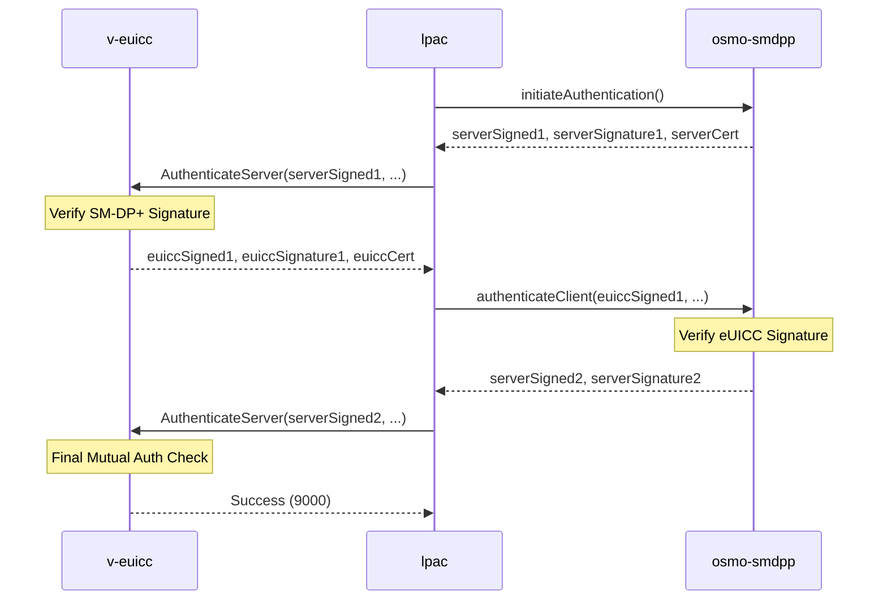

# SGP.22 Profile Download Flow

**[← Previous: Architecture](02-ARCHITECTURE.md)** | **[Index](README.md)** | **[Next: v-euicc Internals →](04-V-EUICC.md)**

---

## Table of Contents
1. [Overview](#overview)
2. [Mutual Authentication Sequence](#1-mutual-authentication-sequence)
3. [Profile Download Preparation](#2-profile-download-preparation)
4. [Bound Profile Package Generation](#3-bound-profile-package-bpp-generation)
5. [Profile Installation](#4-profile-installation-es10b)
6. [Cryptographic Operations Summary](#5-cryptographic-operations-summary)
7. [Observing the Flow](#observing-the-flow)

---

## Overview

This document details the complete remote SIM provisioning flow as implemented in this project, following the GSMA SGP.22 specification.

The RSP flow consists of five major phases:
1. **Discovery** (optional, not implemented)
2. **Mutual Authentication** (ES9+ and ES10b)
3. **Download Preparation** (Key agreement)
4. **Profile Download** (BPP transmission)
5. **Installation** (Profile activation on eUICC)

## 1. Mutual Authentication Sequence

Before a profile can be downloaded, the SM-DP+ and the eUICC must authenticate each other.



## 2. Profile Download Preparation

Once authenticated, the eUICC prepares for the secure download.

1.  **PrepareDownload (ES10b.BF21)**: 
    - The LPA sends a `PrepareDownloadRequest` to the eUICC.
    - The eUICC generates an ephemeral ECKA (Elliptic Curve Key Agreement) key pair (`otPK.EUICC.ECKA` and `otSK.EUICC.ECKA`).
    - The eUICC returns the public key and a signature over the transaction data.

## 3. Bound Profile Package (BPP) Generation

The SM-DP+ creates a package specifically "bound" to this eUICC instance.

1.  **getBoundProfilePackage (ES9+.POST)**:
    - The LPA sends the `prepareDownloadResponse` (containing the eUICC's ephemeral public key) to the SM-DP+.
    - The SM-DP+ generates its own ephemeral key pair.
    - **ECDH Key Agreement**: The SM-DP+ uses its private key and the eUICC's public key to derive a shared secret.
    - **Session Keys**: From the shared secret, the SM-DP+ derives session keys (KEK for encryption, KM for MAC) using a KDF (Key Derivation Function).
    - The SM-DP+ encrypts the profile using these keys and wraps it in a Bound Profile Package (BPP).

## 4. Profile Installation (ES10b)

The BPP is sent to the eUICC via a sequence of APDU commands:

- **BF23: InitialiseSecureChannel**: eUICC derives the same session keys using the SM-DP+'s ephemeral public key.
- **A0: ConfigureISDP**: Configures the ISD-P (Issuer Security Domain - Profile) on the chip.
- **A1/88: StoreMetadata**: Stores the profile's metadata (Name, SPN, ICCID).
- **A2: ReplaceSessionKeys**: (Optional) Replaces session keys with profile-specific keys.
- **86: LoadProfileElements**: Sends the encrypted profile data in segments.
- **A3: Final**: Completes the installation and returns the installation result.

## 5. Cryptographic Operations Summary

The entire flow relies on real cryptographic primitives:

- **ECDSA-P256**: Used for all signatures (AuthenticateServer, AuthenticateClient, etc.).
  - Curve: NIST P-256 (secp256r1)
  - Hash: SHA-256
  - Output: 64 bytes (R || S, each 32 bytes)
  
- **TR-03111 Format**: Signatures are converted between ASN.1 DER (used in ES9+) and raw R||S format (64 bytes, used in ES10x).
  
- **ECDH (Elliptic Curve Diffie-Hellman)**: Used for the one-time key agreement to establish the secure channel.
  - Each party generates an ephemeral key pair (otSK, otPK).
  - Shared secret = otSK.eUICC × otPK.DP = otSK.DP × otPK.eUICC
  
- **KDF (Key Derivation Function)**: Derives session keys from the ECDH shared secret.
  - KEK (Key Encryption Key): 16 bytes
  - KM (Key for MAC): 16 bytes
  - Algorithm: SHA-256 based, as specified in SGP.22 Annex G
  
- **AES-128**: Used for symmetric encryption of profile data within the BPP.
- **CMAC**: Used for message authentication codes to ensure BPP integrity.

## Observing the Flow

You can watch the entire RSP flow in action using the `demo-detailed.sh` script, which provides color-coded output showing each cryptographic step:

```bash
./demo-detailed.sh testsmdpplus1.example.com:8443 TS48v5_SAIP2.3_BERTLV_SUCI
```

See [08-DEMO-SCRIPT.md](08-DEMO-SCRIPT.md) for a detailed walkthrough of the script's output.

---

**[← Previous: Architecture](02-ARCHITECTURE.md)** | **[Index](README.md)** | **[Next: v-euicc Internals →](04-V-EUICC.md)**
