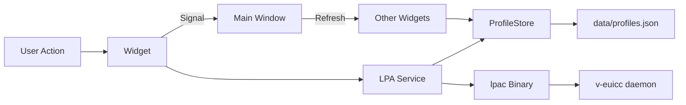

# RSP Control Center (Developer GUI)

**[← Previous: Modifications](05-MODIFICATIONS.md)** | **[Index](README.md)** | **[Next: MNO Console →](07-GUI-MNO-CONSOLE.md)**

---

## Table of Contents
1. [Overview](#overview)
2. [Main Architecture](#1-main-architecture-main_windowpy)
3. [Backend Services](#2-backend-services)
4. [Key UI Widgets](#3-key-ui-widgets)
5. [Signal and Data Flow](#4-signal-and-data-flow)
6. [Running the Application](#running-the-application)

---

The **RSP Control Center** (`gui/`) is a comprehensive developer tool designed to orchestrate the entire eSIM Remote SIM Provisioning stack on a single machine.

## Overview

- **Primary Role**: Local orchestrator and developer debugger.
- **Framework**: PySide6 (Qt for Python).
- **Key Features**:
  - Full control over backend services (start/stop/restart).
  - Integrated multi-component log viewer.
  - Profile installation from local `.der` packages.
  - Real-time eUICC state monitoring.

## 1. Main Architecture (`main_window.py`)

The application follows a modular architecture where the `MainWindow` acts as a coordinator between specialized widgets and backend services.

### Layout
- **Top Row**: 
  - `ProcessPanel`: Service health and control.
  - `ProfileSelector`: Interface to initiate new downloads.
- **Middle Row**: 
  - `ProfileManager`: Table of profiles currently installed on the virtual eSIM.
- **Bottom Row**: 
  - `LogViewer`: Real-time streaming logs from all services.

## 2. Backend Services

### Process Manager (`gui/services/process_manager.py`)
Uses the `subprocess` module to manage `v-euicc-daemon`, `osmo-smdpp.py`, and `nginx`.
- **Startup Logic**: Automatically checks for port availability and clears stale processes using `lsof` and `pkill`.
- **Log Redirection**: Captures `stdout` and `stderr` from each process and redirects them to files in the `data/` directory.

### LPA Service (`gui/services/lpa_service.py`)
A Python wrapper around the `lpac` C binary.
- **Environment Injection**: Configures the necessary environment variables (`LPAC_APDU=socket`, etc.) before executing commands.
- **JSON Parsing**: Captures `lpac`'s JSON output and converts it into Python dictionaries for the UI.

### Profile Store (`gui/services/profile_store.py`)
Manages the shared `data/profiles.json` file.
- **Atomic Operations**: Uses a "write-to-temp-then-rename" pattern to prevent file corruption.
- **Thread Safety**: Implements file locking (`fcntl.flock`) to ensure data integrity when multiple processes or threads access the store.

## 3. Key UI Widgets

### Log Viewer (`gui/widgets/log_viewer.py`)
- **Real-time Streaming**: Uses a `QTimer` to poll log files every 500ms.
- **Smart Scrolling**: Automatically scrolls to the bottom unless the user has manually scrolled up to inspect an error.
- **Multi-Tab**: Separates logs for each component (v-euicc, SM-DP+, nginx, tests).

### Profile Selector (`gui/widgets/profile_selector.py`)
- **Discovery**: Scans `pysim/smdpp-data/upp/` for available `.der` profile packages.
- **Trigger**: When a profile is selected and "Download" is clicked, it calls `lpa_service.download_profile()`.

## 4. Signal and Data Flow

The GUI uses Qt's signal/slot mechanism for loose coupling between widgets.

### Example: Enabling a Profile

1.  **User Click**: User clicks "Enable" on a profile in the `ProfileManager`.
2.  **Service Call**: `ProfileManager` calls `lpa_service.enable_profile(iccid)`.
3.  **Command Execution**: `lpa_service` runs `./lpac profile enable <iccid>`.
4.  **Store Update**: The `ProfileStore` updates `data/profiles.json` with the new state.
5.  **UI Feedback**: On success, `ProfileManager` emits a `profile_changed` signal.
6.  **Global Update**: `MainWindow` catches the signal and tells all other widgets to refresh their state from the `ProfileStore`.

### Data Flow Diagram


## Running the Application

```bash
./run-gui.sh
```

This script automatically:
1. Runs `./teardown.sh` to kill any stale processes.
2. Starts `v-euicc-daemon`, `osmo-smdpp`, and `nginx`.
3. Launches the PySide6 GUI.
4. Shuts down all services when the GUI is closed.

---

**[← Previous: Modifications](05-MODIFICATIONS.md)** | **[Index](README.md)** | **[Next: MNO Console →](07-GUI-MNO-CONSOLE.md)**
